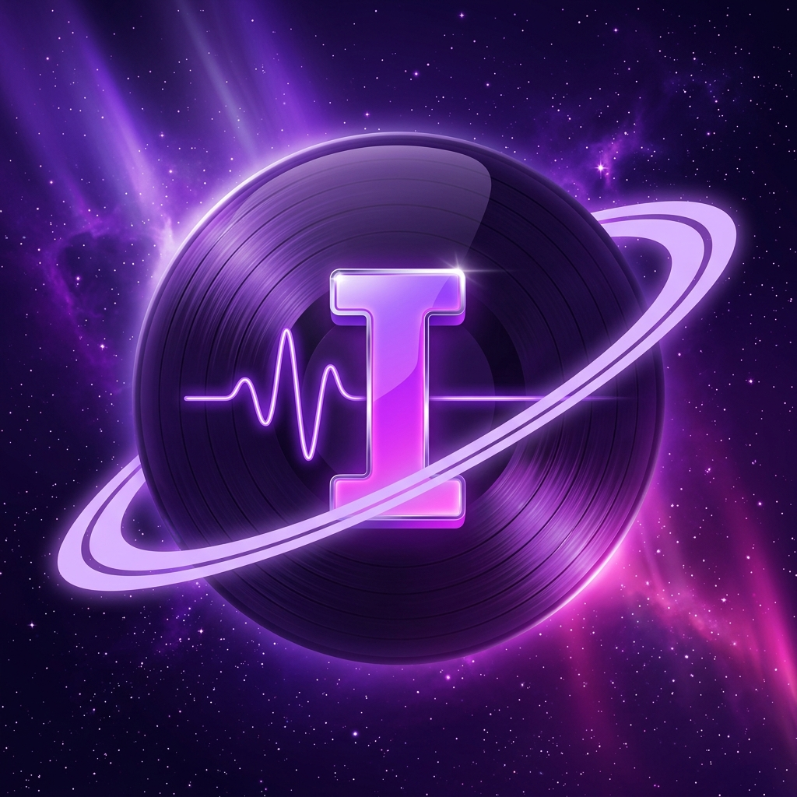
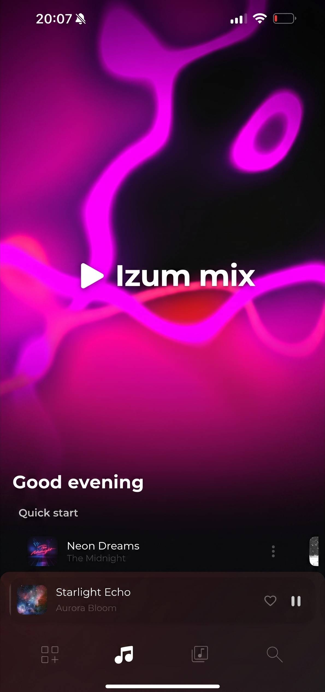

# Izum Music

### Your music, on your servers. No subscriptions, no compromises.

**Izum Music** is a full-stack, self-hosted music service. Deploy it on a server or your personal computer and own your entire library — forever.

---

### ❤️ Support Me

If you find this project useful, you can support its development:

---

---

## Overview

Izum Music is modern streaming under your control. Instead of renting access to music through a subscription, you host the service yourself and keep full ownership of your data and content. Run it on a dedicated server, a home machine, or fully locally without any server at all.

The project consists of a backend, a frontend and cross-platform clients — all designed to give you the same smooth experience everywhere, while keeping everything in your hands.

## Why Izum Music

| Feature | Description |
| --- | --- |
| 🔒 **Full control** | Install on a server or PC — all your data stays with you. |
| 💸 **No subscriptions** | You own the access and the content. Forever. |
| 📱 **Cross-platform** | iOS, Android, macOS, Linux and Windows — the same UX everywhere. |
| 📧 **SMTP support** | Connect your own mail server for notifications and account flows. |
| 🎚️ **Izum Mix** | Personal mixes based on your taste. A simplified version works offline. |
| 📥 **Painless offline** | Download tracks and browse artists/albums as if you were online. |
| 💻 **Local mode** | Use without a server — just import your tracks into the app. |
| 🏷️ **Auto metadata** | No need to create artists and albums manually — the app reads metadata for you. |
| 🧩 **Custom plugins** | Extend the player with your own plugins: integrations, audio effects, new sources. Fully open SDK. |

## Izum Music Space

> **Hub that launches backend & frontend** *(Beta)*

**Izum Music Space** is a friendly hub that runs the backend and frontend for you. Run it locally or via Docker — Space will guide you. No need to mess with raw JARs, configs or web servers.

- **Launch the backend** (`.jar`) with one button — no terminal or Java commands.
- **Launch the site frontend** (`dist`) just as easily.
- **Docker is supported** — Space can spin everything up in a single click.

## Plugins

Extend Izum Music with your own plugins: new music sources, audio effects, and integrations. The SDK is fully open, so you can build whatever the player is missing for you.

Plugin development documentation is available in both Russian and English, including dedicated AI style guides.

## Getting Started

1. **Download the client** for your platform (iOS, Android, macOS, Linux or Windows).
2. **Choose how to run it:**
   - **Self-hosted** — deploy the backend and frontend on your server.
   - **Izum Music Space** — let the Space hub launch the backend and frontend for you (locally or with Docker).
   - **Local mode** — skip the server entirely and import your own tracks directly into the app.
3. **Import your library** — Izum Music reads metadata automatically and builds out artists and albums for you.

## Pro tip · Easter egg

> Hold the **play/pause** button while the player is open. 😉

## Community & Help Wanted

Documentation and video tutorials are still in the works — but the app already lives and grows thanks to its community.

If you've already gotten the hang of **Izum Music** / **Izum Music Space**, you have a real chance to help thousands of new users get on board faster. Any format is welcome:

- 🎥 A short video or stream
- 📝 A written guide or FAQ
- 💡 Just a set of tips — *"here is how I figured it out"*

Even a small how-to written in plain, friendly language is more valuable than a perfect manual that does not exist.

### Get in touch

- 💬 Reach out on **Telegram**
- 🐛 Open a **GitHub Issue**

## Support

If the app turned out to be useful to you and you want to support its development — a donation would be sincerely appreciated. It helps put more time into new features and, yes, into proper documentation.

## License

All license documents related to Izum Music are collected in this repository:

- [`IZUM_MUSIC_LICENSE.md`](IZUM_MUSIC_LICENSE.md) — Izum Music license agreement
- [`IZUM_MUSIC_SPACE_LICENSE.md`](IZUM_MUSIC_SPACE_LICENSE.md) — Izum Music Space license agreement
- [`PLUGIN-LICENSE.md`](PLUGIN-LICENSE.md) — Plugin license
- [`libs_licenses.md`](libs_licenses.md) — Third-party library licenses

---

**Made with love for music** — *Izum · Vinipuhov*

